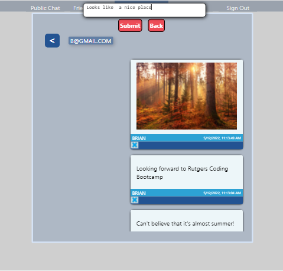
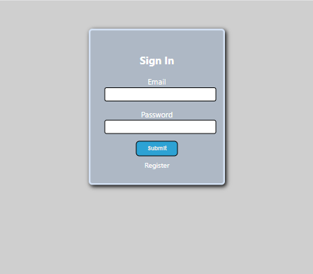

# Messaging App
Messaging App is my first Full Stack application that I made teaching myself the basics of react before I attended Rutgers Coding Bootcamp.  

This app is a full stack app using React, Node, Express, Knex, Postgres, cors, as well as using socket.io for real time messages.  This is the repo for the front-end code that is deployed on GitHub pages.  The [back-end code](https://github.com/bthalpin/messagingAppServer) is deployed on Heroku.

Register to join the Messaging App community.  Send messages to the whole community or just to people in your friends list. Have something private to say? Message your friends directly and stay connected. 

## Table of Contents

[Links](#links)

[Media](#media)

[Questions](#questions)

## Links
[Messaging App](https://bthalpin.github.io/messagingApp)
        
## Media
The following image displays home page (Public Messages Page):

This image displays the private message page:

This is the login page:

## Questions
If you have any questions contact me directly at <brian.t.halpin@gmail.com>. You can find more of my work at [Brian Halpin](https://github.com/bthalpin).

